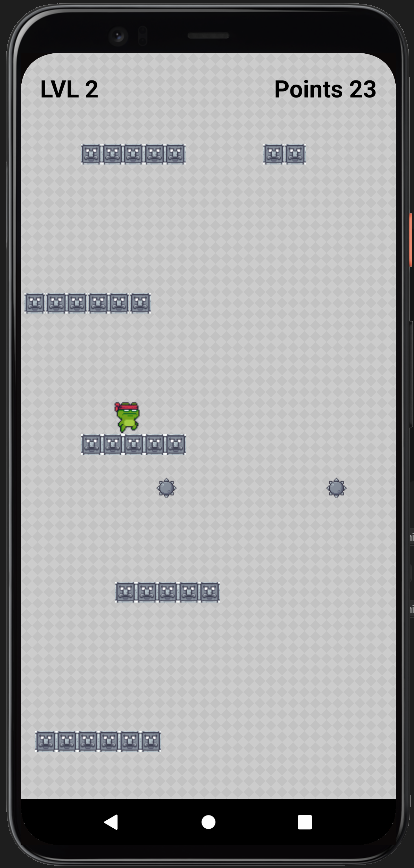
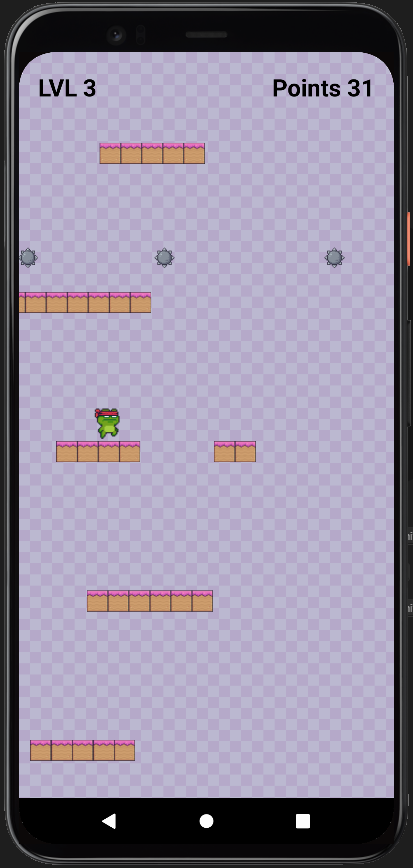

# Ninja Frog - React Native
> Simple 2D platform game on mobile phones about jumping frog and scoring points.

## Table of contents
* [General info](#general-info)
* [Screenshots](#screenshots)
* [Setup](#setup)
* [Tech/framework used](#techframework-used)
* [Status](#status)
* [Contact](#contact)
* [License](#license)

## General info
>Game is build based on Matter.js providing physics both with React Native Game Engine providing game loop. 

## Screenshots

   

       
Level 1

    <ul>
      
    </ul>
   

	

       
Level 2

    <ul>
      
    </ul>
   

	

       
Level 3

    <ul>
      
    </ul>
   

## Setup

>1. Enter game folder
>2. In terminal: npm install
>3. In terminal: npx expo start
## Tech/framework used

* React Native
* React Native Game Engine
* Matter.js

## Status
Project is: Finished :grin:

## Contact
[@Bartosz Koscielniak](https://www.linkedin.com/in/bartosz-ko%C5%9Bcielniak-95008024a/)

## License
[MIT](https://choosealicense.com/licenses/mit/) ©

